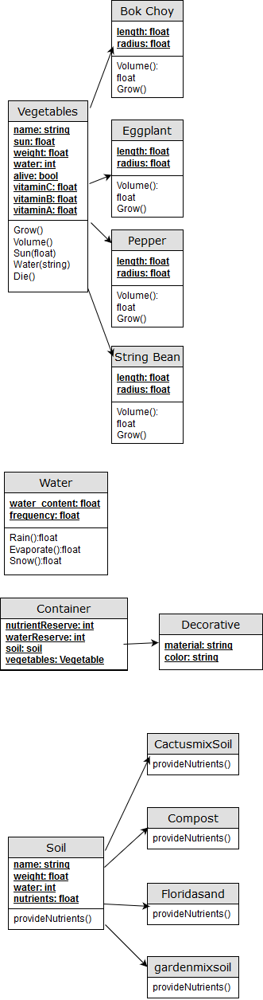

## **P**ortable **O**rganic **T**rouble-free **S**elf-watering System (**POTS**) Model

This model is for an automatic watering system which simulates watering a variety of veggies with different types of soil
and predetermined watering conditions.

All vegetables have a variety of attributes for everything from weight to vitaminC needs as well as its size. 
All vegetables implement their own custom growth and volume calculations.

Each type of soil provides a differing number of nutrients and has a different weight and moisture content.

The container class helps determine how the container affects how nutrients and water are maintained.

The water class is responsible for determing the effects of rain, evaporation and snow.

