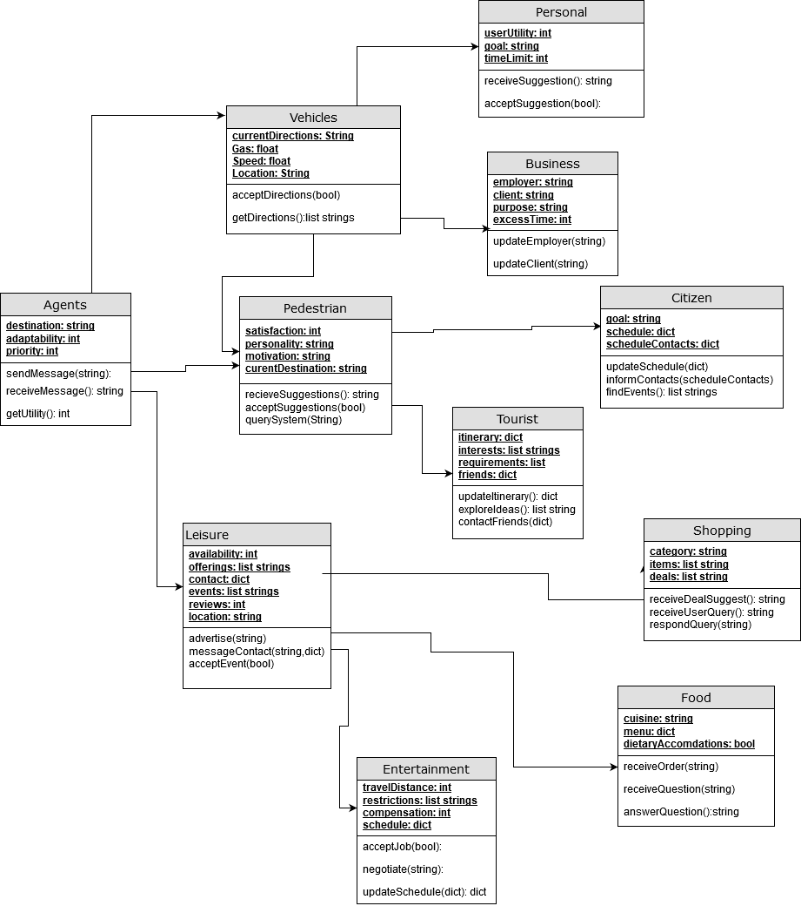

## Smart City (Street Congestion) Model - Agent Class Diagram

This shows the class diagram for all the different agents in the system. There are three main categories of agents: vehicle, pedestrain and entertainment.

Vehicles are divided into personal and business. Vehicles can all receive navigation instructions from the system as well as suggestions for changes to their directions.
Personal vehicles include any person going about their day to day life including commute to work.
Business includes business travel such as delivery trucks. These are treated differently by the system since business vehicles
have different constraints.

Pedestrian agents including anyone walking on the sidewalk. Pedestrians are divided into citizens and tourists. 
All of these have a unique set of motivations and personality that determines behavior and what they want out of the system.
Citizens are people who live in the city and tourists are those who are visiting. These groups have different goals and want different suggestions from the system.

Lastly entertainment agents include everything from shops to food trucks and restaurants and street performers. 
These are used to help convince people to stay in a less congested area to help with flow control. For example, if an area is 
expected to get too congested a shop could offer a flash deal to keep people there or a street performer could put on an act.
