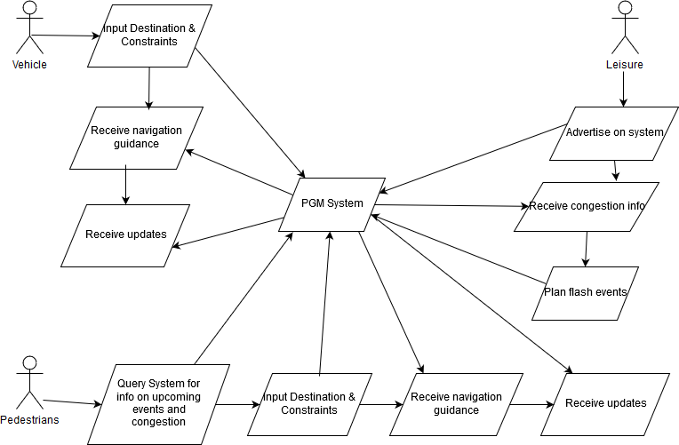

## Smart City (Street Congestion) Model - Agent Use Case Diagram

This shows how users interact with the system

All three types of agents have unique interactions with the system.  Vehicles can input their plans and receive navigation
and guidance designed to properly direct traffic to reduce congestion. This will take into account the obvious differences
in priority of a delivery driver making deliveries across town from an average person on their day off.

Pedestrians can not only input plans but also receive real time updates of planned entertainment events, deals at shops
and restaurants and food truck appearances designd to help redirect flow by encouraging people to spread out better.
The user can obviously choose to ignore these suggestions and this will partly be predicted by the system on the basis
of the inferred personality.

The leisure agents are able to coordinate with the system to help encourage people to reduce congestion. Shops can choose
to advertise deals that will only be displayed when its desirable to have more people in that directions. Food trucks 
can plan their routes based on area density and street performers can choose to put on performances in appropriate areas.
