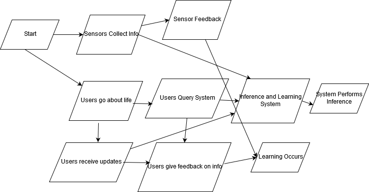

## Smart City (Street Congestion) Model -Behavior Diagram

This shows the behavior diagram for how the various components interface with the PGM system.

The general idea is that at the start of the system sensors start collecting data and people can interface with the system.
Agents can get system updates on a schedule determined by them and can also query the system to get suggestions of upcoming
events advertised through the system or if they're an entertainment agent advertise on the system. The user can give 
feedback on the system. This as well as data from the sensors are used as learning data so the system can imporve overtime.
