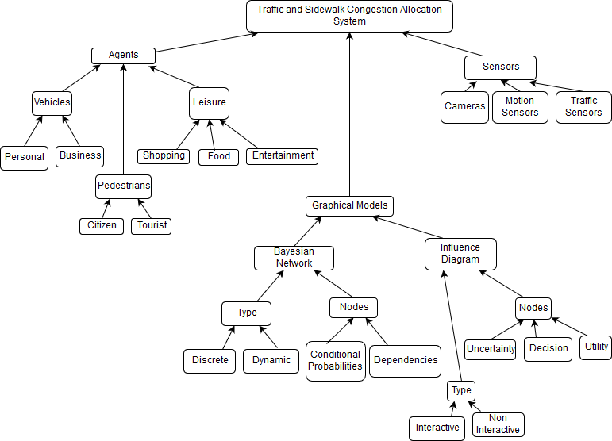

## Smart City (My Problem) Model - Object Diagram

This is an overview of the system used to manage sidewalk and street congestion on city streets. There are three main coponents: agents, the graphical models used for AI and the various sensors.

The agents have three main types vehicle, pedestrians and leisure. I tried to break these up as much as I felt was needed for a higher level. Eventually I'd probably add even more leisure categories and some subcategories for pedestrians that would be learned from the AI system.

The AI system uses Bayesian Networks to classify things like pedestrian personality and the influence diagram is used to actually learn how to allocate resources. 

The sensors represent the ability to know where people actually are in the world which is needed for the system to actually allocate resources.
