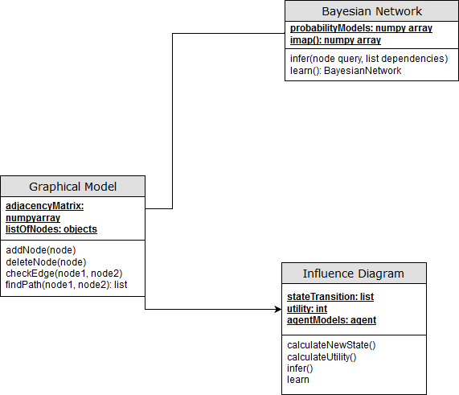

## Smart City (Street Congestion) Model - Agent Class Diagram

This shows the class diagram for the different types of probabilistic graphical models.

There are two main types of models: bayesian networks and interactive dynamic influence diagrams.

Bayesian networks are used to predict the most likely state of the sensors to infer and learn to predict future patterns.
The interactive dyanmic influence diagrams are a graphical representation of a partially observable markov decision process (POMDPs).

This allows decisions to be made when the entire state is not observed. This is essential for anything involving agents since the
system is not capable of reading minds. The influence diagrams are dynamic since they are working over many time steps and intercative
since it works with multiple agents.

PGMs are useful because they can be hand solicited from experts and then tuned using machine learning algorithms from data. 
This allows both prior knowledge of the system and machine learning to be combined. Its also a natural fit for modeling and 
simulation since its a modeling language. They are also much more intuitive then most machine learning algorithms.
