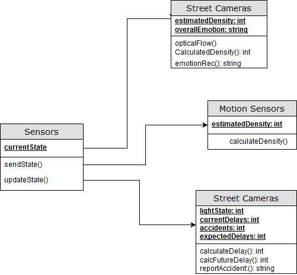

## Smart City (Street Congestion) Model - Sensor Class Diagram

This shows the class diagram for all the different agents in the system. There are three main categories of agents: vehicle, pedestrain and entertainment.

There are three types of sensors. All sensors use Bayesian Networks to help calculate their states with a higher degree of
certainty.

The street cameras are one of the methods of population density calculation using optical
flow as well as emotion recognition using computer vision.

The motion sensors also calculate density to help increase certainty for the cameras.

The traffic sensors help determine current traffic congestion and future patterns.
